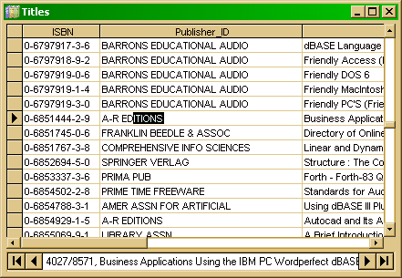

<div align="center">

## Wolf DataGrid 1\.5 ActiveX Control


</div>

### Description

Version 1.5 of award winning Wolf DataGrid, fully working data grid now with many new features.
 
### More Info
 


<span>             |<span>
---                |---
**Submitted On**   |
**By**             |[TheAlas\.com](https://github.com/Planet-Source-Code/PSCIndex/blob/master/ByAuthor/thealas-com.md)
**Level**          |Intermediate
**User Rating**    |4.9 (68 globes from 14 users)
**Compatibility**  |VB 5\.0, VB 6\.0
**Category**       |[Databases/ Data Access/ DAO/ ADO](https://github.com/Planet-Source-Code/PSCIndex/blob/master/ByCategory/databases-data-access-dao-ado__1-6.md)
**World**          |[Visual Basic](https://github.com/Planet-Source-Code/PSCIndex/blob/master/ByWorld/visual-basic.md)
**Archive File**   |[](https://github.com/Planet-Source-Code/thealas-com-wolf-datagrid-1-5-activex-control__1-60039/archive/master.zip)


### Source Code

```
Very nice ADO recordset editing/viewing tool, quite fast (although it will be more faster later) and very stable. It uses no subclassing and no hooking which improves stability. The main objective is to replace the wretched Microsoft DataGrid, I have seen many “grids” and there were very few that actually worked as they should work, it is hard to make a good data-aware grid that will work with cpp, vb and Delphi. So, I made one in VB, full context sensitive win32 help is provided, all most important properties, methods and functions are present, code is well organized, error handling is descent, it supports most stuff that MS DataGrid supports. You can now create database applications in vb as almost as good as ones made in Access – and no 10mb controls that cost more than MS Access itself.
Enough talking, in the following download you have the WolfDataBaseSystem.vbp file, compile it (make sure that the compiled file is in the same dir as the rest of the package) and open TestingGroup.vbg file or Tutorials.vbg file. I’ve made some nice tutors to introduce you to the grid, just the basic features. The zip is big because the example database takes 300kb, it have about 30 000 000 fields for testing the performance (loading lookup columns, and using “AutoFit” feature).
If you have less than 1GHz cpu then Tutor2 may take about 10 seconds to load, be patient.
Don’t forget that there is a complete context-sensitive help in package, everything is documented except events (there are only 2 events for now, since most of them are provided by ADO).
If you are actually liked the version 1.0 then you will surely like this, it has lots o new stuff :).
I probably forgot to mention a whole bunch of things, but it should all work good, if you’re stuck with something, read the help first or contact me before giving bad votes or something.
Oh, and sorry for download thingie, psc’s upload tool never actually worked right so I had to put it to my server, psc wont even allow html – no compiled files are included.
Download zip file from here:
http://www.thealas.com/wg.zip
```

